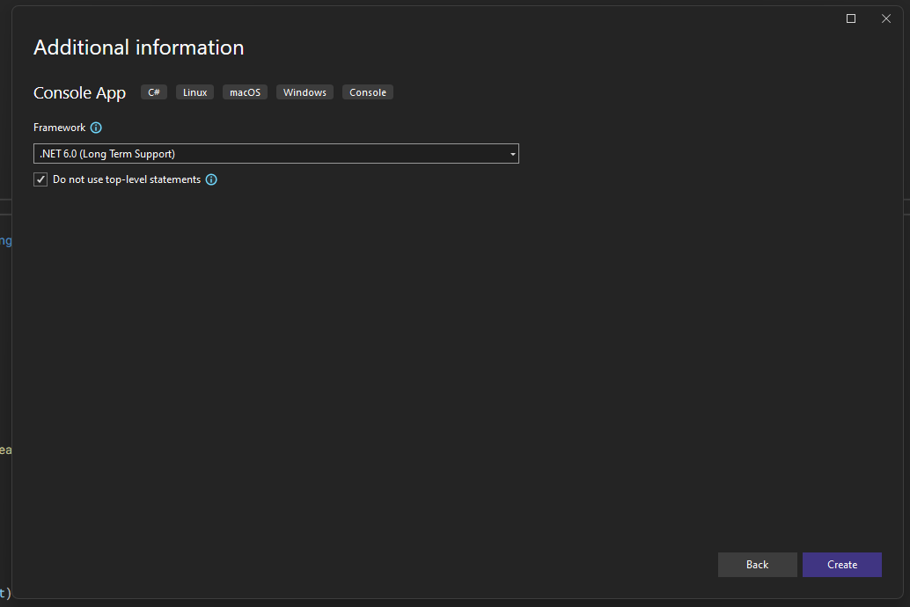

# Shell Template

The template Shell project, updated to .NET 6.0.

## How to add projects to the solution

1. Right click the solution file, find `Add`, and and click `New Project`

2. Select `Console App` for the project type and click next

3. Set the name for the project here; this should be the name of the command you're adding.

4. Use the default version of .NET.

5. Add a project reference: Right click the item named `Dependencies`, which is below the project labelled `Shell`. Then click `Add Project Reference`.

6. Ensure all the boxes for the commands and click `Ok`.

